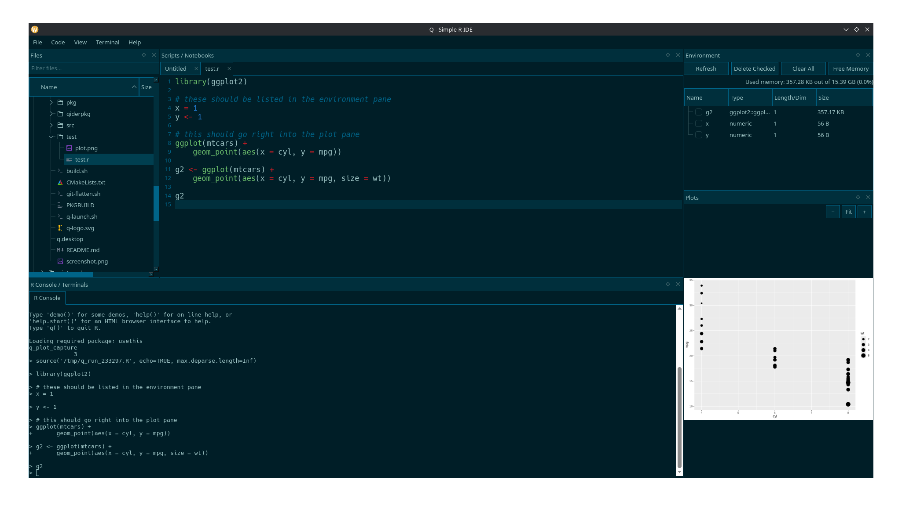

# Q - A Simple Qt-based R IDE

## Goals 

Q is a lightweight Integrated Development Environment (IDE) for the R Programming Language, built using the Qt framework, with the goal of providing a minimal expansion over the R GUI for Windows but multiplatform (Linux, Windows, MacOS or anything that supports Qt and can build C++ code).

I find the R GUI really nice but too minimal for some users, so Q aims to be something in between the R GUI, RStudio and classic tools such as Stata, providing a few more features while keeping things simple and fast.

Here is a screenshot of the current version:



## Features

Q offers a clean and user-friendly interface for writing, running, and debugging R code. It includes: syntax highlighting, an integrated R console, and themes support (obtained from https://github.com/Gogh-Co/Gogh).

Features in progress: code completion, version control/environment/plots panels, adding shortcuts for the pipe operator, better R Markdown/Quarto support, check Windows compatibility, etc.

Nice features for R packages developers: Highlighting for C/C++ code, after all I use lots of C++ in my R packages.

## Why Q?

Minimal approach: I tried Positron and it is just not for me. I prefer a lightweight, fast, and simple R-focused IDE. Q is designed to be minimalistic and efficient, allowing myself to focus on R code without unnecessary distractions. Plus, with my arthritis I am more of a keyboard user than a mouse user.

Open Source: As a Manjaro Linux user, I feel the non-Ubuntu Linux world is underserved when it comes to readily available software, often relying on volunteers around the world that port DEB/RPM files. Q starts upside-down by providing an easy way to build and package the software for any distributions, and it is fully Open Source under the Apache 2.0 License.

Educational purposes: When it is more complete, I will use it in my lectures/tutorials. I think its minimal design will help students focus on learning R without being overwhelmed by complex IDE features and without the temptation of using AI tools for coding on early stages of learning programming. I am totally fine with the use of AI tools for mundane tasks in advanced courses where students already know programming fundamentals.

## Installers

I used Copilot to build an installer for Windows (I do not know much about Windows). You can download it [here]().

## Build and test

```
./build.sh --clean
./q-launch.sh
```

## Package

I use Manjaro, so this is how I package the app. Please open an issue if you would like an installer
for Ubuntu, Fedora, or another distribution of the extremely fragmented Linux ecosystem.

```
./build.sh --package
sudo pacman -U --noconfirm grog-1.0.0-1-x86_64.pkg.tar.zst
```

## License

Q is licensed under the Apache License 2.0. See the [LICENSE](LICENSE) file for details.

